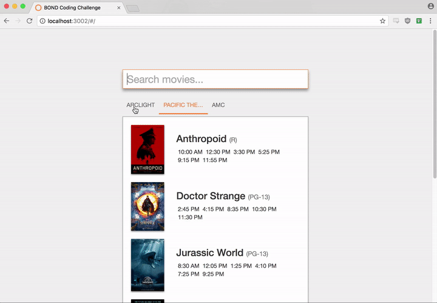
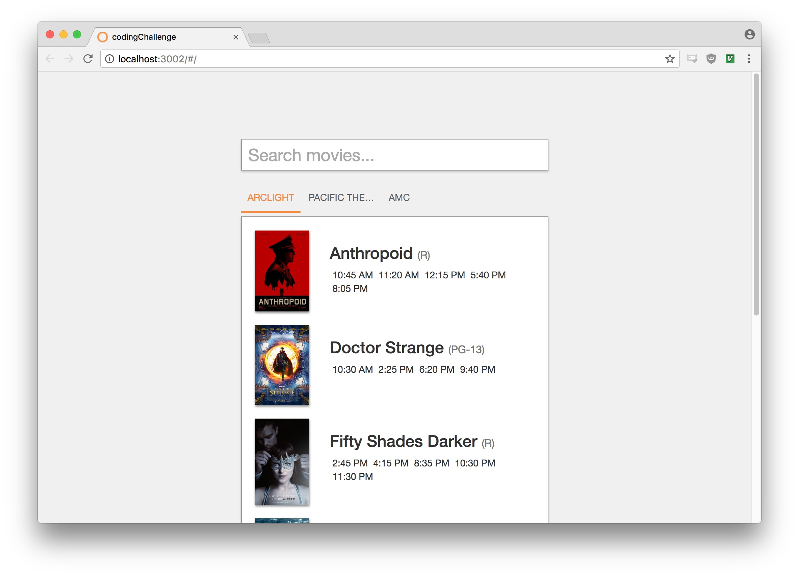
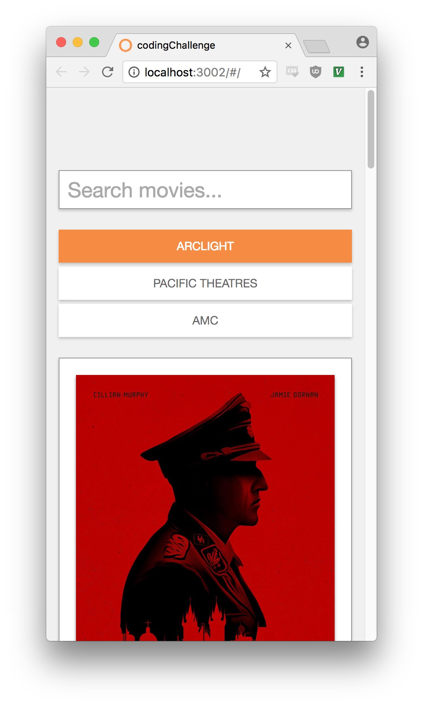
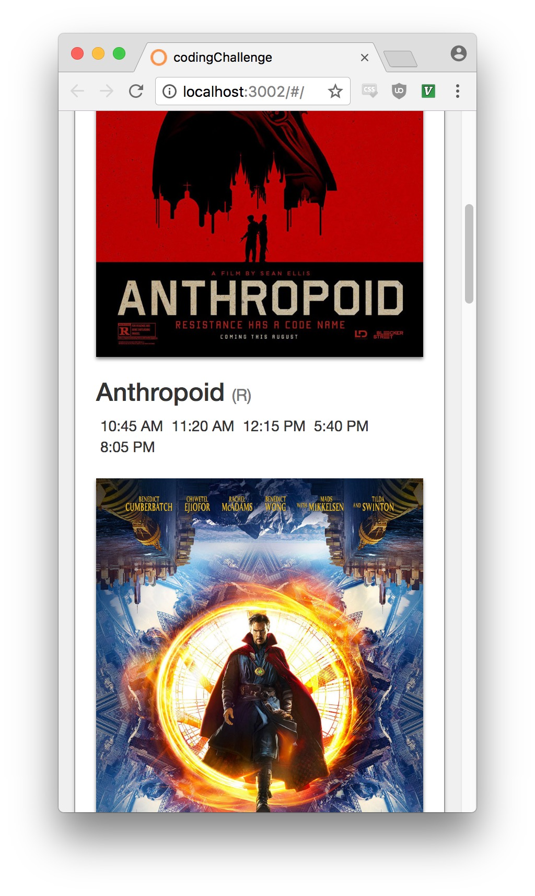

#
Made with Angular 12
ng serve --open to run locally

# Frontend Assignment

## Introduction

The main purpose of this exercise is to get a feel for your approach to problem solving, code style and comfort with different aspects of developing for the web.

Such a small application does not require state management, router... but fell free to use for the test purpose.

Our stack includes TypeScript, React and Styled Components. It is not a requirement, but would be nice to see your skills with these.

Please, keep the commit history ;)

Good luck!

## Movie Showtimes App

Build an interactive, responsive movie showtimes app as shown in the mock images.

### Instructions

- Use the JSON files inside `data/` to drive the results
- Use any frontend framework/library/build tool you are comfortable with, designing the app for the possibility of expanding features
- Using the mock images as reference, match styles as closely as possible
- Responsive Behavior: Make sure the app gracefully scales down to a mobile view
- API (`theater_showtimes.json` and `movie_metadata.json`) gives you showtimes for "today"
- You own the datasource, feel free to manipulate the JSON files' format (but show why if you felt the need to do so)

### Nice to have

Please, feel free to improve functionality as you see fit. We've outlined some of our ideas below:

- Sort movies by title
- Sort showtimes by date/time
- CSS "Fade" showtimes that have already passed
- Filter by rating (G, PG-13, R)

### Unit testing

Also not a requirement, but we would love to see some unit tests.

## Submit Your App

Assume we will install and run the project, so make sure to include relevant files and instructions.

### Thanks!

We really appreciate you taking the time for this assignment.

**All copyrights belong to their respective owners.**
